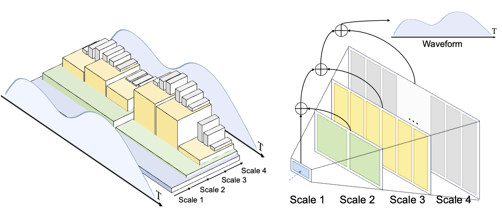

# Efficient Autoregressive Audio Modeling via Next-Scale Prediction


<div align="center">

[]()&nbsp;
[](https://arxiv.org/pdf/2408.09027)&nbsp;
[]()&nbsp;

</div>
<p align="center" style="font-size: larger;">
  <a href="https://arxiv.org/pdf/2408.09027">Efficient Autoregressive Audio Modeling via Next-Scale Prediction</a>
</p>

<p align="center">

<p>

<be>
  
# Updates 

- (2024.08.21) Add inference code, will release checkpoint and training code soon.
- (2024.08.20) Repo created. Code and checkpoints will be released in this week.

# Dataset

We download our Audioset from website https://research.google.com/audioset/ and collect it as 

```
AudioSet
├── audioset_unbalanced_train_mp3
├── unbalanced_train_segments.csv
└── audioset_balanced_raw_mp3
```

# Installation

- Install all packages via ```pip3 install -r requirements.txt```.


# Inference

```
python3 inference_SAT.py --config config/SAT_config.yaml --resume /path/to/ckpt.pth --test_dir /path/to/audioset_eval_raw_mp3 --batch_size $bs
```


# Citation
```
@misc{qiu2024efficient,
    title={Efficient Autoregressive Audio Modeling via Next-Scale Prediction},
    author={Kai Qiu and Xiang Li and Hao Chen and Jie Sun and Jinglu Wang and Zhe Lin and Marios Savvides and Bhiksha Raj},
    year={2024},
    eprint={2408.09027},
    archivePrefix={arXiv},
    primaryClass={cs.SD}
}
```
